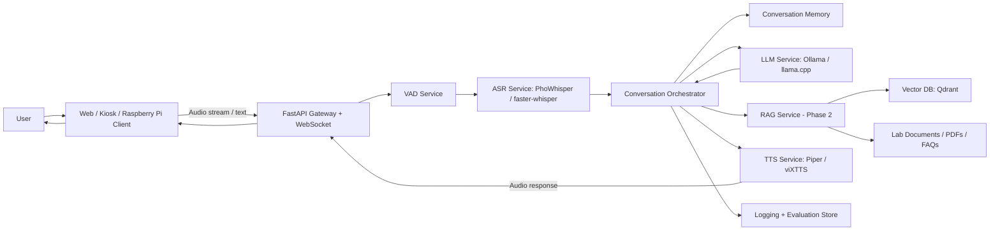

# AI Lab Assistant – Production-Oriented Implementation Plan

> Project goal: Build a Vietnamese AI assistant for school labs that can receive input via text and voice, answer in Vietnamese, run primarily with local models, and be scalable enough for real lab deployment.

---

## 1. Final Chosen Direction

The recommended architecture is:

```text
Local-first, service-based AI assistant deployed on an internal lab server.
Clients such as web browsers, kiosk PCs, or Raspberry Pi terminals only handle microphone, speaker, and UI.
All heavy AI processing runs on a central server inside the school/lab network.
```

This is the best direction because it balances four requirements:

1. **Easy to scale**: many lab clients can connect to one central AI server.
2. **Near production**: services are separated, containerized, observable, and maintainable.
3. **Local-first**: ASR, LLM, TTS, and RAG can run inside the school network without sending data to external APIs.
4. **Flexible**: each model component can be replaced independently.

---

## 2. Target Use Case

The assistant should eventually support:

- Vietnamese voice conversation.
- Vietnamese text conversation.
- Answering questions about lab rules, equipment, schedules, documents, and procedures.
- Acting as a lab information assistant for students and lecturers.
- Optional future support for tool usage, such as checking room schedules, retrieving documents, or controlling lab devices.

For Phase 1, the scope should stay focused:

```text
User speaks Vietnamese
→ system converts speech to text
→ local LLM generates answer
→ system converts answer to speech
→ user hears the response
```

---

## 3. High-Level Architecture



---

## 4. Component Decisions

### 4.1 Client Layer

Recommended clients:

| Client Type | Role |
|---|---|
| Web browser | Main user interface for testing and deployment |
| Kiosk PC | Stable lab terminal |
| Raspberry Pi | Thin client only: microphone, speaker, browser/app |
| Mobile browser | Optional future access |

The client should not run heavy models. Its responsibilities should be:

- Capture microphone audio.
- Send audio stream or recorded audio to backend.
- Display transcript and response.
- Play TTS audio.
- Provide text chat fallback.

---

### 4.2 Backend Gateway

Recommended technology:

```text
FastAPI + WebSocket
```

Responsibilities:

- Receive text input.
- Receive audio input.
- Manage voice sessions.
- Call ASR, LLM, RAG, and TTS services.
- Return text and audio response.
- Handle authentication and rate limiting in later phases.

Recommended API design:

```text
POST /chat/text
POST /chat/voice
WebSocket /ws/voice
POST /asr/transcribe
POST /tts/synthesize
GET  /health
GET  /models
```

For Phase 1, synchronous HTTP endpoints are acceptable. For near-production voice interaction, WebSocket should be introduced to reduce latency and support streaming interaction.

---

### 4.3 VAD Service

Recommended model:

```text
Silero VAD
```

Purpose:

- Detect when the user starts speaking.
- Detect when the user stops speaking.
- Reduce unnecessary ASR processing.
- Improve UX by avoiding manual stop-record clicks.

Phase 1 can start with button-based recording. VAD should be added after the basic voice loop is stable.

---

### 4.4 ASR Service – Speech to Text

Recommended primary model:

```text
PhoWhisper-base or PhoWhisper-small for development
PhoWhisper-medium or PhoWhisper-large for better production accuracy
```

Recommended inference engine:

```text
faster-whisper / CTranslate2 when possible
```

Why:

- PhoWhisper is designed specifically for Vietnamese ASR.
- It is suitable for Vietnamese accents.
- faster-whisper is useful when the team needs better inference speed and lower memory usage.

Suggested implementation path:

1. Start with direct PhoWhisper inference.
2. Measure latency and accuracy.
3. Convert or deploy using faster-whisper if latency is too high.
4. Add audio preprocessing:
   - 16 kHz mono WAV
   - noise reduction if needed
   - silence trimming
   - chunking for long audio

Output format:

```json
{
  "text": "Nội quy phòng lab là gì?",
  "language": "vi",
  "confidence": 0.87,
  "duration_ms": 1320
}
```

---

### 4.5 LLM Service

Recommended primary option:

```text
Ollama + Qwen3 8B
```

Fallback / alternative options:

```text
Qwen3 4B       -> weaker machine, lower latency
Qwen3 14B      -> stronger GPU/server
VinaLLaMA 7B   -> Vietnamese-oriented alternative
llama.cpp GGUF -> deeper deployment optimization
```

Why Ollama first:

- Easy to run locally.
- Easy REST API integration.
- Easy model switching.
- Good for development and internal deployment.

Recommended first model:

```bash
ollama pull qwen3:8b
```

If the server is weak:

```bash
ollama pull qwen3:4b
```

If the server has stronger GPU:

```bash
ollama pull qwen3:14b
```

Recommended system prompt for Phase 1:

```text
You are a Vietnamese AI assistant for a university lab.
Answer clearly, politely, and concisely in Vietnamese.
If you do not know the answer, say that you do not know instead of inventing information.
For lab-related questions, prefer safe and procedural answers.
```

---

### 4.6 TTS Service – Text to Speech

Recommended production-first option:

```text
Piper TTS
```

Recommended higher-naturalness option:

```text
viXTTS
```

Decision:

- Use **Piper** first if stability, speed, and local deployment are more important.
- Use **viXTTS** later if natural Vietnamese voice quality is a priority.
- Keep TTS as a separate service so the project can switch voices or engines later.

TTS output:

```json
{
  "audio_path": "outputs/response_001.wav",
  "sample_rate": 22050,
  "duration_ms": 2400
}
```

Important preprocessing before TTS:

- Normalize Vietnamese text.
- Convert numbers to spoken form when needed.
- Remove unsupported symbols.
- Split long responses into shorter sentences.

---

## 5. Deployment Architecture

### 5.1 Development Deployment

Use Docker Compose.

```text
developer laptop
├── api-gateway
├── asr-service
├── llm-service
├── tts-service
├── redis
├── postgres
└── qdrant
```

### 5.2 Lab Deployment

Recommended lab topology:

```text
Lab LAN
│
├── AI Server
│   ├── ASR service
│   ├── LLM service
│   ├── TTS service
│   ├── RAG service
│   ├── database
│   └── monitoring
│
├── Lab Client 1
├── Lab Client 2
├── Lab Client 3
└── Admin Dashboard
```

This avoids installing heavy AI models on every lab machine.

### 5.3 Future Scaling

When the number of clients grows:

| Bottleneck | Scale Strategy |
|---|---|
| ASR slow | Run multiple ASR workers |
| LLM slow | Use stronger GPU, quantized models, request queue |
| TTS slow | Cache common answers, multiple TTS workers |
| RAG slow | Optimize chunking/indexing, use Qdrant filtering |
| Many users | Add Redis queue, load balancer, worker pool |

---

## 6. Recommended Hardware

### Minimum Development Machine

```text
CPU: 6-8 cores
RAM: 16 GB
GPU: optional
Storage: 50-100 GB
```

Suitable for:

- Qwen3 4B
- PhoWhisper base/small
- Piper TTS
- small number of users

### Recommended Lab Server

```text
CPU: 12-16 cores
RAM: 64 GB
GPU: NVIDIA GPU with 12-24 GB VRAM
Storage: 1 TB SSD
Network: wired LAN
OS: Ubuntu Server LTS
```

Suitable for:

- Qwen3 8B or 14B
- PhoWhisper medium/large
- multiple lab clients
- local RAG over documents

### Raspberry Pi Role

Do not use Raspberry Pi as the main AI processing server.

Use Raspberry Pi as:

```text
microphone + speaker + browser/app + network client
```

---

## 7. Project Folder Structure

```text
ai-lab-assistant/
│
├── README.md
├── plan.md
├── docker-compose.yml
├── .env.example
├── requirements.txt
│
├── services/
│   ├── api_gateway/
│   │   ├── main.py
│   │   ├── routes/
│   │   ├── schemas/
│   │   └── core/
│   │
│   ├── asr_service/
│   │   ├── main.py
│   │   ├── transcriber.py
│   │   └── audio_preprocess.py
│   │
│   ├── llm_service/
│   │   ├── main.py
│   │   ├── ollama_client.py
│   │   └── prompts.py
│   │
│   ├── tts_service/
│   │   ├── main.py
│   │   ├── synthesizer.py
│   │   └── text_normalizer.py
│   │
│   └── rag_service/
│       ├── main.py
│       ├── ingestion.py
│       ├── retriever.py
│       └── chunking.py
│
├── frontend/
│   ├── web/
│   └── kiosk/
│
├── data/
│   ├── documents/
│   ├── audio_samples/
│   ├── logs/
│   └── eval_sets/
│
├── models/
│   ├── asr/
│   ├── tts/
│   └── embedding/
│
├── configs/
│   ├── dev.yaml
│   ├── lab.yaml
│   └── prompts.yaml
│
├── tests/
│   ├── test_asr.py
│   ├── test_llm.py
│   ├── test_tts.py
│   └── test_e2e_voice.py
│
└── docs/
    ├── architecture.md
    ├── api.md
    ├── deployment.md
    └── evaluation.md
```

---

## 8. Docker Compose Draft

```yaml
version: "3.9"

services:
  api-gateway:
    build: ./services/api_gateway
    ports:
      - "8000:8000"
    env_file:
      - .env
    depends_on:
      - redis
      - postgres
      - qdrant

  asr-service:
    build: ./services/asr_service
    env_file:
      - .env
    volumes:
      - ./models/asr:/models/asr
      - ./data/audio_samples:/data/audio_samples

  llm-service:
    image: ollama/ollama
    ports:
      - "11434:11434"
    volumes:
      - ollama:/root/.ollama

  tts-service:
    build: ./services/tts_service
    env_file:
      - .env
    volumes:
      - ./models/tts:/models/tts
      - ./data/audio_outputs:/data/audio_outputs

  qdrant:
    image: qdrant/qdrant
    ports:
      - "6333:6333"
    volumes:
      - qdrant_data:/qdrant/storage

  redis:
    image: redis:7
    ports:
      - "6379:6379"

  postgres:
    image: postgres:16
    environment:
      POSTGRES_DB: ai_lab
      POSTGRES_USER: ai_lab
      POSTGRES_PASSWORD: ai_lab_password
    volumes:
      - postgres_data:/var/lib/postgresql/data

volumes:
  ollama:
  qdrant_data:
  postgres_data:
```

---

## 9. Development Roadmap

### Phase 1 – Voice Chat MVP

Goal:

```text
The assistant can listen to Vietnamese speech and answer back with Vietnamese speech.
```

Tasks:

1. Build text-only chat with local LLM.
2. Add ASR service.
3. Add TTS service.
4. Build simple web UI.
5. Connect full voice loop.
6. Log transcript, response, latency, and errors.
7. Prepare short demo script for lecturers.

Expected output:

```text
User voice → transcript → answer text → answer audio
```

Success criteria:

- Vietnamese speech is recognized with acceptable accuracy.
- Assistant answers in Vietnamese.
- TTS audio is understandable.
- One complete conversation can run without manual backend intervention.
- Average response latency is measured and reported.

---

### Phase 2 – Lab Knowledge Assistant

Goal:

```text
The assistant can answer questions based on lab-specific documents.
```

Tasks:

1. Collect lab documents:
   - lab rules
   - equipment manuals
   - safety instructions
   - schedules
   - FAQ
2. Build document ingestion pipeline.
3. Split documents into chunks.
4. Generate embeddings.
5. Store vectors in Qdrant.
6. Add RAG retrieval before LLM generation.
7. Add source citation in responses.
8. Evaluate answer correctness.

Expected output:

```text
User asks about lab policy
→ assistant retrieves relevant document chunks
→ assistant answers with grounded information
```

---

### Phase 3 – Multi-Client Lab Deployment

Goal:

```text
Multiple lab devices can use the assistant through the same local AI server.
```

Tasks:

1. Deploy on lab server with Docker Compose.
2. Configure clients to connect to server IP.
3. Add basic authentication.
4. Add request queue.
5. Add health checks.
6. Add admin dashboard.
7. Add monitoring and logs.
8. Test with 3-5 concurrent users.

---

### Phase 4 – Production Hardening

Goal:

```text
The assistant is stable, monitorable, maintainable, and safe for real use.
```

Tasks:

1. Add structured logging.
2. Add error handling and retry policy.
3. Add backup strategy for data and vector database.
4. Add model version tracking.
5. Add user feedback collection.
6. Add safety prompt and refusal rules.
7. Add role-based permissions.
8. Add deployment documentation.
9. Add evaluation report.

---

## 10. Evaluation Plan

### ASR Evaluation

Metrics:

- Word Error Rate
- Character Error Rate
- Accent robustness
- Noise robustness
- Average transcription latency

Test set:

- 20-50 Vietnamese questions recorded by different students.
- Include northern, central, southern accents if possible.
- Include noisy lab background samples.

### LLM Evaluation

Metrics:

- Answer relevance
- Vietnamese fluency
- Factual correctness
- Hallucination rate
- Safety behavior
- Average generation latency

Test questions:

- General conversation
- Lab rules
- Equipment usage
- Safety procedures
- Unknown questions where the assistant should say it does not know

### TTS Evaluation

Metrics:

- Intelligibility
- Naturalness
- Pronunciation quality
- Latency
- Stability on long answers

### End-to-End Evaluation

Metrics:

```text
Total latency = ASR latency + LLM latency + TTS latency
```

Target:

```text
Prototype: under 10 seconds per turn
Improved demo: under 5 seconds per turn
Production target: under 3 seconds for common short queries
```

---

## 11. Security and Privacy Requirements

Since the system may be deployed in a school lab, privacy should be part of the design from the beginning.

Recommended rules:

1. Default to local processing inside the school network.
2. Do not send voice recordings to cloud APIs unless explicitly enabled.
3. Allow disabling audio recording storage.
4. Store logs without sensitive personal information when possible.
5. Add authentication for admin features.
6. Keep model and document versions traceable.
7. Add clear notice if conversations are logged.
8. Restrict document upload and RAG indexing to authorized staff.
9. Back up database and document store.
10. Never let the model invent official lab policy.

---

## 12. Risk Analysis

| Risk | Impact | Mitigation |
|---|---:|---|
| ASR fails in noisy lab | High | Use VAD, noise reduction, better microphone, PhoWhisper medium/large |
| LLM hallucinates lab policy | High | Add RAG, require citations, answer "I do not know" when evidence is missing |
| Latency too high | High | Use smaller quantized LLM, faster-whisper, response streaming, cache common answers |
| TTS pronunciation poor | Medium | Add Vietnamese text normalization, compare Piper and viXTTS |
| Server overloaded | Medium | Add queue, worker pool, rate limiting |
| Hard to maintain | High | Use service-based architecture, Docker Compose, logs, docs |
| Privacy concern | High | Local-first processing, configurable logging, access control |
| Raspberry Pi too weak | Medium | Use Pi only as thin client |

---

## 13. Recommended First Sprint

Duration:

```text
1-2 weeks
```

Goal:

```text
Build a working local voice assistant MVP.
```

Tasks:

1. Create repository structure.
2. Create FastAPI gateway.
3. Run Ollama with Qwen3 4B or 8B.
4. Implement text chat endpoint.
5. Implement ASR service with PhoWhisper.
6. Implement TTS service with Piper or viXTTS.
7. Build simple web UI with record button.
8. Connect the full voice loop.
9. Log latency for each stage.
10. Prepare demo video/script.

Definition of done:

- User can speak Vietnamese into microphone.
- System shows recognized transcript.
- System generates Vietnamese answer.
- System plays Vietnamese voice response.
- Logs show ASR, LLM, TTS latency separately.
- The system runs from documented setup commands.

---

## 14. Suggested Demo Script

Example questions:

```text
Xin chào, bạn là ai?
Bạn có thể làm gì?
Nội quy phòng lab là gì?
Làm sao để sử dụng máy in 3D trong phòng lab?
Nếu tôi không biết câu trả lời trong tài liệu thì bạn sẽ làm gì?
```

For Phase 1, only the first two questions need to work well.

For Phase 2, lab-specific questions should be answered using RAG from real documents.

---

## 15. Setup Commands – Initial Prototype

### Install Ollama model

```bash
ollama pull qwen3:8b
```

or for weaker machines:

```bash
ollama pull qwen3:4b
```

### Run API services

```bash
docker compose up --build
```

### Test text chat

```bash
curl -X POST http://localhost:8000/chat/text \
  -H "Content-Type: application/json" \
  -d '{"message": "Xin chào, bạn là ai?"}'
```

### Test health check

```bash
curl http://localhost:8000/health
```

---

## 16. Final Recommendation

The final recommended system is:

```text
FastAPI + WebSocket backend
+ PhoWhisper/faster-whisper ASR
+ Silero VAD
+ Ollama Qwen3 8B local LLM
+ Piper first, viXTTS later for Vietnamese TTS
+ Qdrant for Phase 2 RAG
+ Docker Compose for deployment
+ Web/kiosk/Raspberry Pi clients as thin clients
```

This is the most reasonable direction because it is not just a student demo. It gives the project a path from MVP to real lab deployment without rewriting the whole system later.

---

## 17. References

- Ollama API Documentation: https://docs.ollama.com/api/introduction
- Ollama Qwen3 Model Library: https://ollama.com/library/qwen3
- FastAPI Documentation: https://fastapi.tiangolo.com/
- FastAPI WebSocket Documentation: https://fastapi.tiangolo.com/advanced/websockets/
- PhoWhisper Hugging Face: https://huggingface.co/vinai/PhoWhisper-large
- PhoWhisper GitHub: https://github.com/VinAIResearch/PhoWhisper
- faster-whisper GitHub: https://github.com/SYSTRAN/faster-whisper
- Silero VAD GitHub: https://github.com/snakers4/silero-vad
- Piper TTS GitHub: https://github.com/rhasspy/piper
- viXTTS Hugging Face: https://huggingface.co/capleaf/viXTTS
- Docker Compose Documentation: https://docs.docker.com/compose/
- Qdrant Quickstart: https://qdrant.tech/documentation/quickstart/
